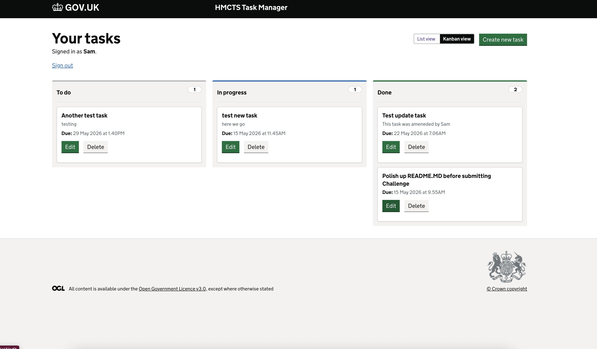
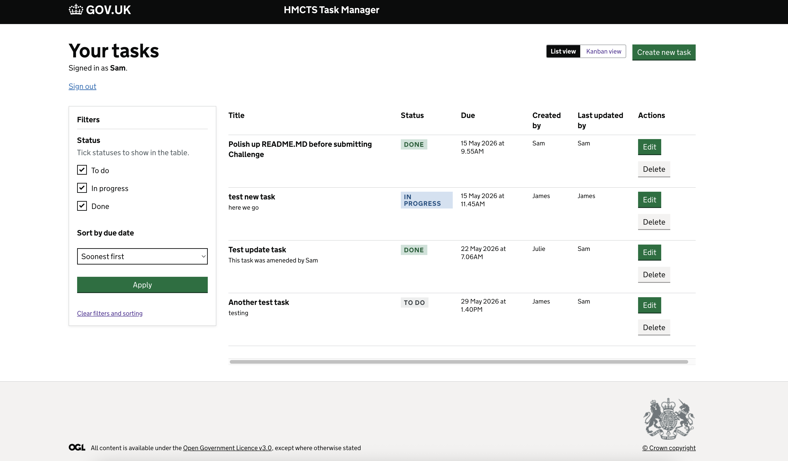

# HMCTS Task Manager - Frontend

The GOV.UK-styled frontend for the HMCTS caseworker task management system.

## Tech Stack

- Node.js 18+
- TypeScript
- Express
- Nunjucks (with GOV.UK Frontend components)
- express-session (for caseworker name persistence)
- axios (server-side API calls to the backend)
- dotenv (loads `.env` at server startup)

## Running Locally

### Prerequisites

- Node.js 18+ - [download here](https://nodejs.org/)
- Yarn - if you do not have it, install it after Node.js with:
  ```bash
  npm install -g yarn
  ```
- The [backend service](https://github.com/letsdoworkalready/-hmcts-tech-dev/blob/main/hmcts-dev-test-backend/README.md) running on `http://localhost:4000`

### Setup and start

Run the following steps in order from the `hmcts-dev-test-frontend` directory:

**1. Install dependencies**

```bash
yarn install
```

**2. Environment file**

Copy the example env file and edit if needed (ports, API URL, session secret):

```bash
cp .env.example .env
```

The app loads `.env` from the project root when `src/main/server.ts` starts (`dotenv`).

**3. Build static assets (GOV.UK CSS, JS)**

```bash
yarn webpack
```

**4. Start the development server**

```bash
yarn start:dev
```

Alternatively, open `package.json` and run the `start:dev` script directly from your IDE.

With `yarn start:dev`, **nodemon** sets `DEV_USE_HTTP=true`, so the app serves **http://localhost:3100** (see `nodemon.json`).

### Environment variables

Set these in **`.env`** (from `.env.example`) or in the host environment. The table matches `.env.example` and the in-code fallbacks in `server.ts`, `app.ts`, and `routes/tasks.ts`.

| Variable         | Example / default       | Description                                               |
| ---------------- | ----------------------- | --------------------------------------------------------- |
| `PORT`           | `3100`                  | Port the frontend listens on                              |
| `API_BASE_URL`   | `http://localhost:4000` | Base URL for the backend API                              |
| `SESSION_SECRET` | (see `.env.example`)    | Secret for signing session cookies - change in production |
| `DEV_USE_HTTP`   | `true` (via nodemon)    | Use plain HTTP in development so the browser does not treat local TLS as insecure |

## Application Flow

1. **Welcome screen** (`/welcome`) - caseworker enters their name before accessing the app.
2. **Tasks** (`/tasks`) - after sign-in you land on the **Kanban** board by default (three columns: To do, In progress, Done). Use the view control to open **List view** at `/tasks?view=list` for a sortable table with a **Filters** sidebar (status checkboxes and sort by due date).
3. **Create task** (`/tasks/new`) - form to create a new task.
4. **Edit task** (`/tasks/:id/edit`) - form to update task details or status.
5. **Delete task** - delete control on each task (Kanban cards and list rows) with a confirmation dialog.

The caseworker's name is stored in an HTTP-only server-side session cookie and sent as the `X-Actor-Name` header on all mutating API requests, populating the audit trail.

### Task views (Kanban and List)

**Kanban** is the default. **List** adds filters and due-date ordering for the same data.





## Running Tests

Tests use **Jest**. Route tests **mock the backend with nock**; you do not need the API running for them.

| Command            | What it covers                                                                                            |
| ------------------ | --------------------------------------------------------------------------------------------------------- |
| `yarn test:unit`   | Utilities and small units under `src/test/unit` (e.g. date and name formatting helpers)                   |
| `yarn test:routes` | Express HTTP behaviour (`src/test/routes`) – home, welcome, sign-out, and tasks pages with the API mocked |
| `yarn test`        | In local development this runs the **unit** suite only (same as `yarn test:unit` when not in CI)          |

Run both Jest suites:

```bash
yarn test:unit && yarn test:routes
```

## Design Decisions

- **Progressive enhancement and GOV.UK-friendly flows** - task create, update, and delete use standard HTML form POSTs handled entirely on the server, so the service remains usable without relying on client-side scripting for core actions.
- **Server-side API calls only** - the frontend proxies all API requests server-side via axios, which keeps the backend URL private and simplifies deployment without cross-origin browser configuration.
- **Session-backed caseworker context** - the caseworker’s name lives in an express-session cookie so each request behaves like a signed-in user for this exercise, giving a realistic task workflow without building a full user authentication stack.
- **Resilience and Validation** - form submissions include server-side validation (e.g. mandatory caseworker name). If the backend API becomes unavailable, the frontend gracefully catches the 500/503 errors and renders a GOV.UK styled error banner rather than crashing, ensuring a robust user experience.
